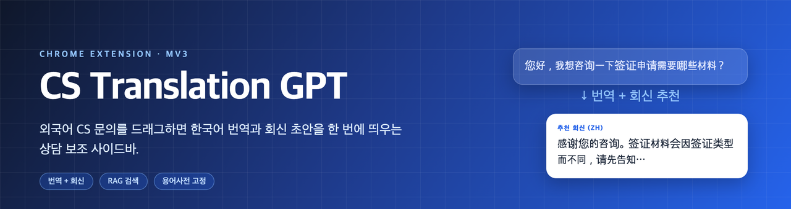
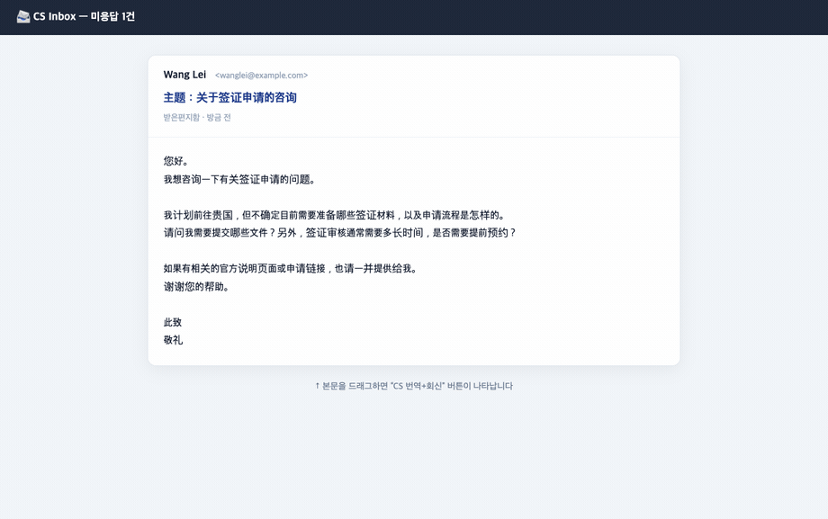
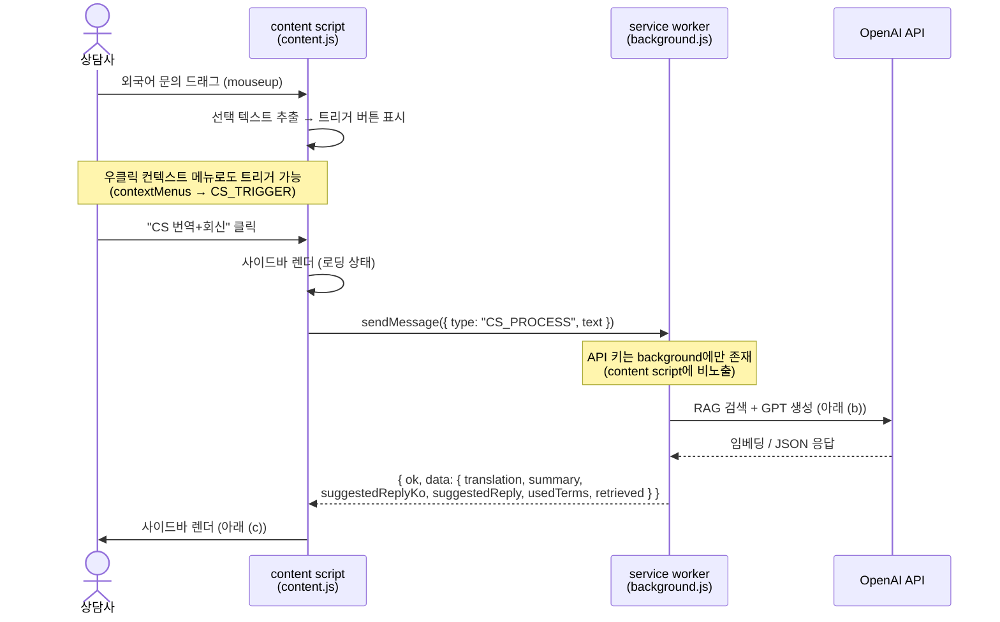
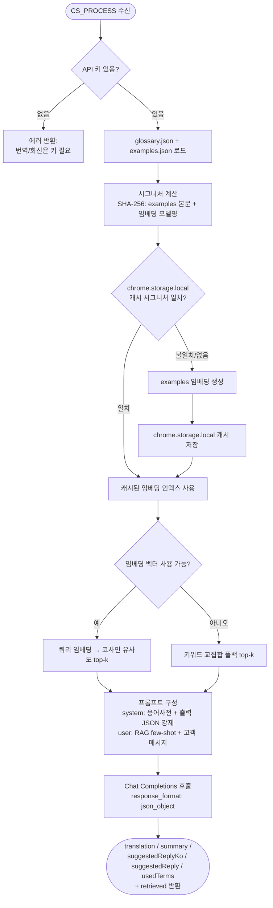
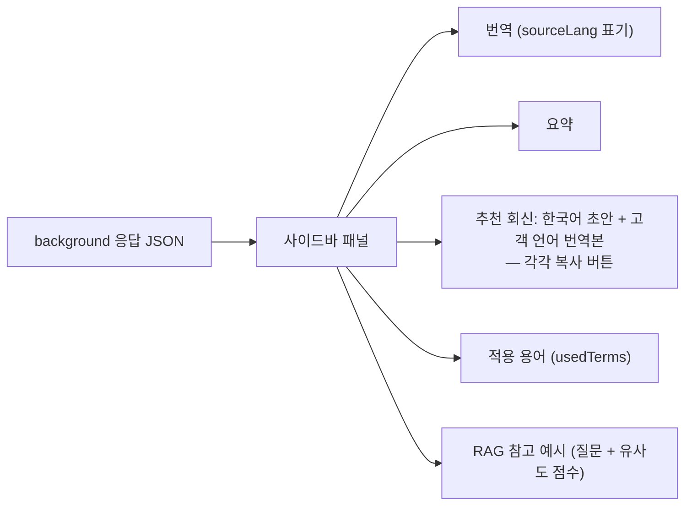

# CS Translation GPT

다국어 CS 상담을 돕는 크롬 확장(Manifest V3). 외국어 문의를 드래그하면 사이드바에 한국어 번역과 회신 초안이 같이 뜬다. 회신은 한국어 초안(내용 확인용)과 고객 언어 번역본(복사해서 발송)을 함께 내놓고, 과거 답변을 RAG로 검색해서 톤과 정책을 맞춘다.

Hiredivercity에서 외국인등록증(RC) 발급 관련 다국어 온라인 CS를 하면서, 문의 1건 처리 시간을 줄이려고 만든 사내 도구가 출발점이었다. 이 저장소는 사내 코드와 데이터를 빼고 개념만 다시 구현한 공개용 버전이다(예시 데이터는 합성).

## 데모

중국어 비자 문의 메일을 드래그해서 한국어 번역 → 요약 → 중국어 회신 초안까지 만들고 복사하는 과정이다.



## 동작 흐름

```
[CS 화면에서 외국어 문의 드래그]
        │  (mouseup → 트리거 버튼 / 우클릭 메뉴)
        ▼
[content script] 선택 텍스트 추출 → background로 전달
        ▼
[background service worker]
   1) RAG: examples(과거 답변) 임베딩 → 코사인 유사도 top-k 검색
   2) GPT: 용어사전 + RAG 예시 주입 → 번역/요약/회신(JSON) 생성
        ▼
[사이드바] 번역 · 요약 · 추천 회신(복사) · 적용 용어 · RAG 참고 예시 표시
```

### (a) 드래그 → content script → background worker

MV3에서 content script와 service worker는 메시지 패싱으로만 통신한다(`chrome.runtime.sendMessage` / `onMessage`). API 키는 background에만 두기 때문에, content script는 키를 모른 채 텍스트만 넘긴다.



### (b) background 내부: RAG 검색 + GPT 생성

RAG 인덱스는 `examples`(질문/답변 쌍)를 임베딩해 `chrome.storage.local`에 캐시한다. 캐시 키는 예시 본문 해시와 임베딩 모델명을 합친 SHA-256 시그니처라, 예시가 바뀌면 자동으로 다시 계산된다. 키가 없거나 임베딩 호출이 실패하면 키워드 교집합 폴백으로 동작한다.



### (c) 사이드바 렌더

background가 돌려준 JSON을 받아 섹션별로 렌더한다. 추천 회신에는 클립보드 복사 버튼을 단다.



## 설계 메모

번역기만 쓰면 내용 파악까지밖에 안 된다. CS는 회신을 쓰는 게 일이라, 번역과 회신 초안을 한 번에 내놓게 했다.

일반 번역기는 "Korea University" 같은 고유명사를 엉뚱하게 의역해서 신뢰도가 떨어진다. 그래서 고유명사, 비자 코드, 정책 용어는 용어사전으로 묶어 system prompt에 고정한다.

같은 유형 문의(RC 발급 기간, 주소 정정, 대리 수령 등)에 매번 다른 톤으로 답하지 않도록, 과거 답변을 검색해 few-shot으로 넣는다.

API 키는 service worker에만 둔다. 상담 페이지에 키가 닿지 않게, OpenAI 호출은 전부 background에서 한다.

## 구조

```
manifest.json              # MV3
src/
  background.js            # 요청 오케스트레이션 (RAG → GPT)
  content/
    content.js            # 드래그 감지 + 사이드바 UI
    sidebar.css
  popup/                   # 설정(API키/모델/Top-K/용어사전)
    popup.html, popup.js
  lib/
    openai.js             # Chat Completions + Embeddings
    rag.js                # 임베딩 인덱스 캐시 + 코사인 검색 (+키워드 폴백)
    prompts.js            # 용어사전 + RAG 주입 + JSON 출력 강제
  data/
    glossary.json         # 용어사전(고유명사/비자코드) — 합성
    examples.json         # 과거 답변 예시(RAG 지식) — 합성
```

## 설치 / 사용

1. `chrome://extensions`에서 우상단 개발자 모드를 켜고, "압축해제된 확장 프로그램 로드"로 이 폴더를 선택한다.
2. 확장 아이콘을 눌러 OpenAI API Key를 입력하고 저장한다(모델, Top-K, 용어사전도 여기서 설정).
3. 아무 페이지에서 외국어 텍스트를 드래그하면 뜨는 "CS 번역+회신" 버튼을 누른다(또는 우클릭 → "CS 번역 + 회신 추천").
4. 오른쪽 사이드바에서 번역·요약·추천 회신을 확인하고, 회신은 복사 버튼으로 바로 가져다 쓴다.

키가 없으면 RAG는 키워드 폴백으로 돌지만, 번역과 회신 생성에는 키가 필요하다.

## 기술 스택

Manifest V3, JavaScript(ES Modules, service worker), Chrome Extension API(storage/contextMenus/scripting), OpenAI Chat Completions(JSON mode)와 Embeddings, 코사인 유사도 기반 RAG.

## 한계 / 앞으로

- 임베딩 인덱스는 `chrome.storage.local` 캐시다(예시가 바뀌면 다시 계산). 예시가 커지면 벡터 DB로 빼야 한다.
- 언어 감지는 모델에 맡겼다. 신뢰도가 낮은 입력에 대한 가드는 더 보강할 여지가 있다.
- 조직별로 톤이나 정책을 나누려면 glossary/examples를 프로파일 단위로 확장해야 한다.
